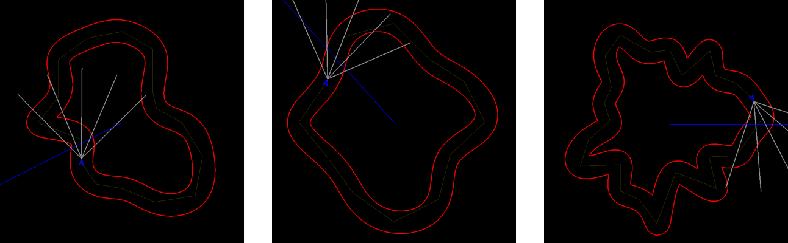

# gym-space-racer #

OpenAI gym environment for space ship racing on the futuristic track.




- https://github.com/openai/gym/blob/master/docs/creating-environments.md

## RocketRacerEnv ##

```python
import gym

env = gym.make('gym_space_racer:rocket-racer-v0')
```

For documentation and configuration parameters read: https://github.com/pkubiak/gym-space-racer/blob/master/gym_space_racer/envs/rocket_racer_env.py

## Installation ##

```bash
git clone https://github.com/pkubiak/gym-space-racer.git
cd gym-spacer-env
pip3 install -e .

python3 test.py  # test installation
```
